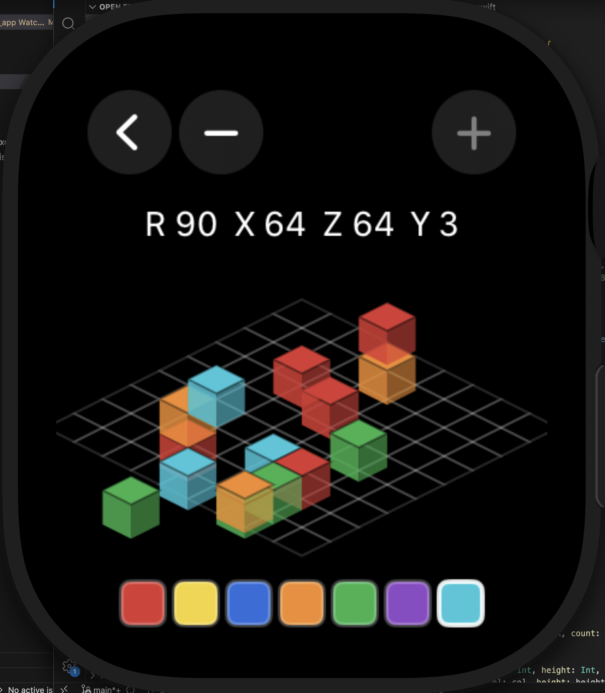

# Apple Watch Voxel

A watchOS voxel-style world editor built with SwiftUI.

## Features

- Create, open, and delete worlds.
- Place/remove colored blocks on an isometric grid.
- Rotate camera, pan the world, and change build height.
- Export worlds to PNG and preview exports on-device.

## Screenshot



## Project Structure

- `Apple Watch Voxel/ContentView.swift` - world list and navigation
- `Apple Watch Voxel/GameView.swift` - isometric editor/game view
- `Apple Watch Voxel/ExportViews.swift` - export list and preview UI
- `Apple Watch Voxel/WorldModels.swift` - domain models
- `Apple Watch Voxel/WorldStore.swift` - world persistence and state
- `Apple Watch Voxel/WorldLibrary.swift` - world creation/export helpers

## Build

```bash
xcodebuild -project "Apple Watch Voxel.xcodeproj" -scheme "Apple Watch Voxel" -destination "generic/platform=watchOS" build
```
